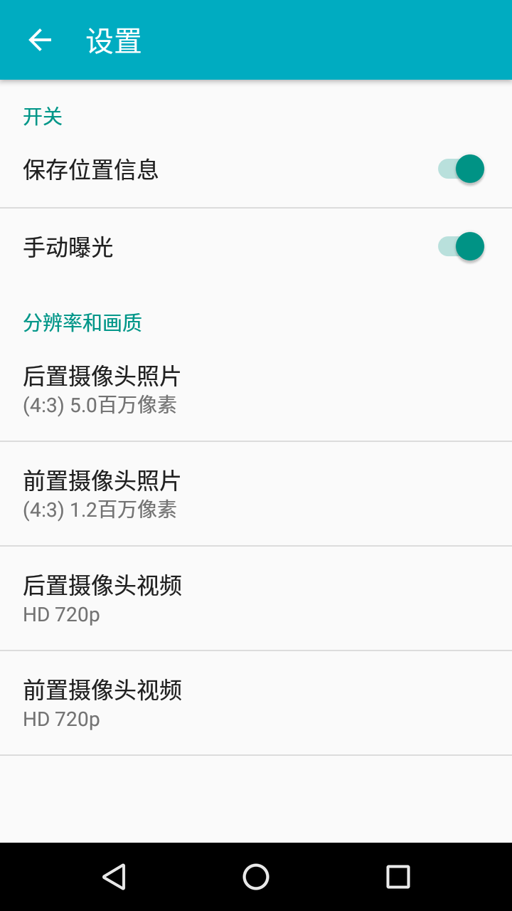

# Camera2_Project

### Overview
- this project can compiled with Android Studio, contain 2 submodules:
- 1. Android Marshmallow Camera2, site: https://github.com/baby518/Camera2_Marshmallow;
- 2. framework/ex/camera2， site: https://github.com/baby518/android_frameworks_ex;

### Screen Shot

